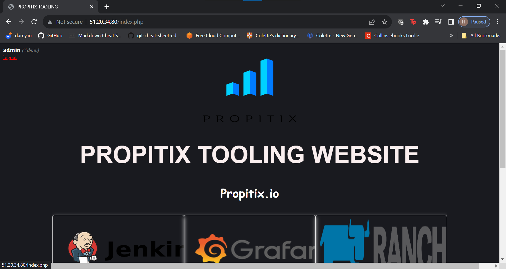

# Devops Tooling Website Solution. #

In this project,I will be implementing a tooling website solution which makes access toDevOps tools within the corporate infrastructure easily accessible.

Some of the *tools* will be 

- **Jenkins** - free and open source automation server used to build *CI/CD* pipelines.

- **Kubernetes** - an open source container-orchestration system for automating computer application deployment,scaling and management.

- **Jfrog Artifactory** - Universal Repository Manager supporting all major packaging formats, build tools and CI
servers. Artifactory

- **Rancher** - an open source software platform that enables organizations to run and manage Docker and
Kubernetes in production.

- **Grafana** - a multi-platform open source analytics and interactive visualization web application.

- **Prometheus** - An open-source monitoring system with a dimensional data model, flexible query language,
efficient time series database and modern alerting approach.

## Prerequisites ##

1. Infrastructure: AWS
2. Webserver Linux: Red Hat Enterprise Linux 8
3. Database Server: Ubuntu 20.04 + MySQL
4. Storage Server: Red Hat Enterprise Linux 8 + NFS Server
5. Programming Language: PHP
6. Code Repository: GitHub

## Implementing a business website using NFS for the backend file storage. ##

I provisioned a **RedHat** instance from AWS and attached 3 volumes to it.

Using `sudo gdisk` I created partions on the attached volumes.

I confirmed that the partitions were created.

Using `sudo yum install lvm2 -y` I installed lvm

`sudo pvcreate /dev/...`, I marked each of the 3 disks as physical volumes.

Next I added all my 3 PVs to a volume group (VG) that I named **vg-webdata**

I created 3 *logical volumes* namely **lv-apps**, **lv-logs** and **lv-opt**.

I than went ahead and formatted as **xfs** by using the command `sudo mkfs -t xfs /dev/webdata-vg/..` 

Next I created 3 mount points and mounted my *Logical volumes* to the respectful mount points.

I than installed **NFS** server and configured it to start on reboot and made sure it was up and runnning by issueing the below commands.

`sudo yum -y update`

`sudo yum install nfs-utils -y`

`sudo systemctl start nfs-server.service`

`sudo systemctl enable nfs-server.service`

`sudo systemctl status nfs-server.service`

I than set up permissions that would allow my websevers to read, write and execute files on the**NFS**

By editing the `sudo vi /etc/exports`,
I gave access toNFS for clients within the same subnet.

By issueing the following command `rpcinfo -p | grep nfs` I was able to see what port was being used by **NFS** and opened the ports by adding anew inbound rule on my instance.

## Configuring backend database. ##

I provisioned a **ubuntu** instance from *AWS* and named it as Db_server.

I installed **MySQL** using `sudo apt install mysql`

I went ahead to create a database and named it *tooling*. I also created a user namely, webaccess and granted permissission to *webaccess* user on *tooling* database to do anything only from the webservers **subnet cidr**

## Preparing the Web Servers ##

I provisioned 3 *RedHat* instances from *AWS* and did the following to all 3 of them.

I installed **NFS** client on them by issuing the following command `sudo yum install nfs-utils nfs4-acl-tools -y`

I mounted */var/www/* and targeted the NFS server's export for apps.

I installed installed *remi's repository, *apache* and *PHP* 

I also mounted the log folder for *Apache* to NFS server's export for logs.

I edited `/etc/fstab` so that the mountings would persist on the web server after reboot.

I forked the tooling source code from Darey.io Github Account to my git hub account.

Opened port 80 on all the webservers.

# Results #

