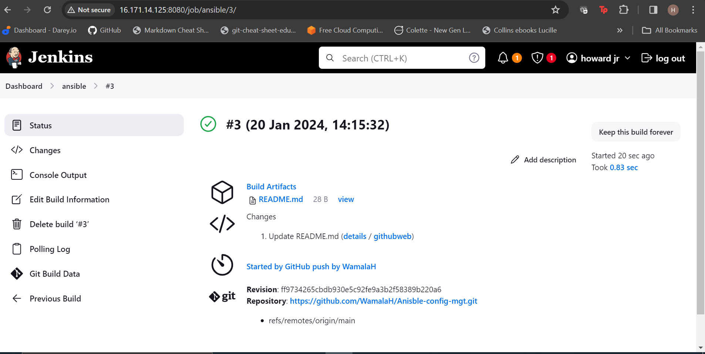
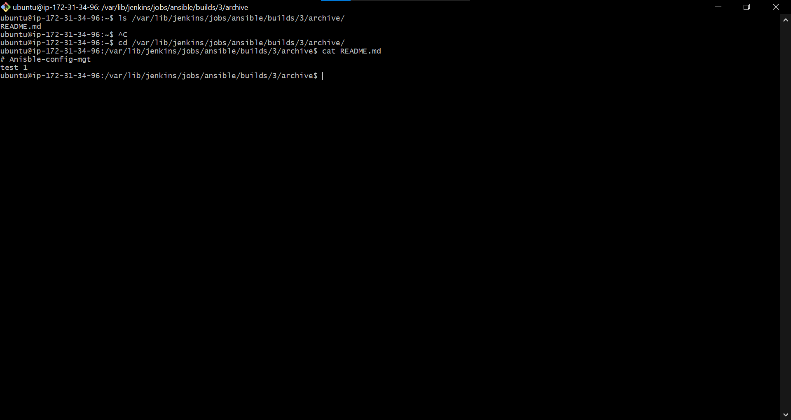
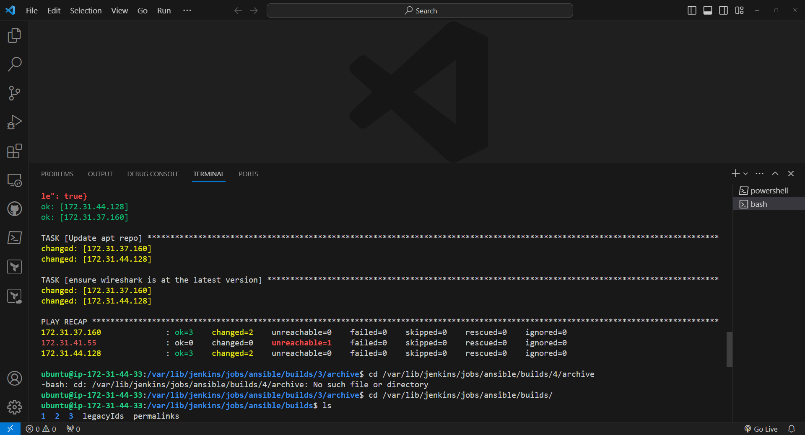
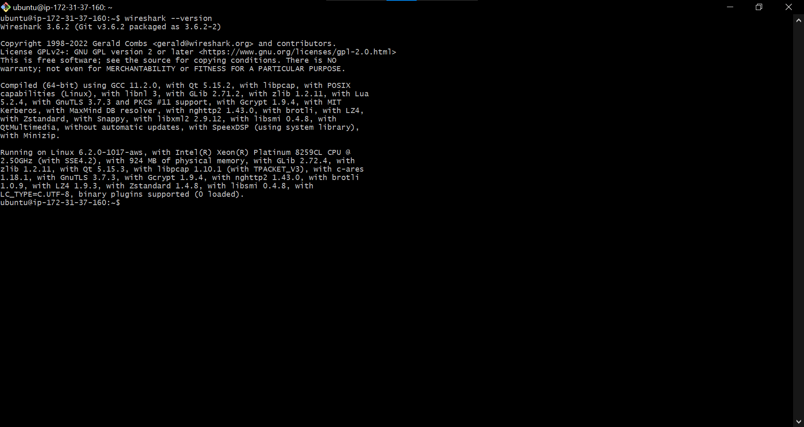

# Ansible Configuration Management - Automate Project #

In this project I will attempt to automate the installation of **wireshark** onto two servers using *Ansiable* .

## Tasks ##

- Install and configure Ansible client to act as a Jump Server/Bastion Host.
- Create a simple Ansible playbook to automate servers configuration.

## Step 1 - Install and Configure Ansible on EC2 Instance. ##
I provisioned an instance from *AWS* with **UBUNTU** and installed **Ansible**. I also installed and configured **Jenkins** on the same instance.

I went ahead to create a new repository and named it *ansible-config-mgt*

I configured *Jenkins* to run auto-build when it detects any changes in my *ansible-config-mgt* repo and tested that it works.

I confirmed that *jenkins* was saving the build artifacts in the following folder.
**/var/lib/jenkins/jobs/ansible/builds/<build_number>/archive/**

I than went ahead and cloned *ansiable-config-mgt* repo to my local machine using **VSCODE** and also created a new branch.

I created afew directories and files on my new branch.

Since *ansible* uses port 22 which means it needs to *ssh* into target servers, I had to implement and configure **ssh-agent** to run on my machine by installing,starting **ssh-agent** and adding ssh-keys as well.

I than went ahead to create a pull request and merged the branch I created *Prj-11* with the main branch.

Confirmed that *jenkins* build.

I than run the following command to test ansible.

**ansible-playbook -i inventory/dev.yml playbooks/common.yml**

And the results.

I confirmed that wireshark was installed on my targeted servers/machines.

