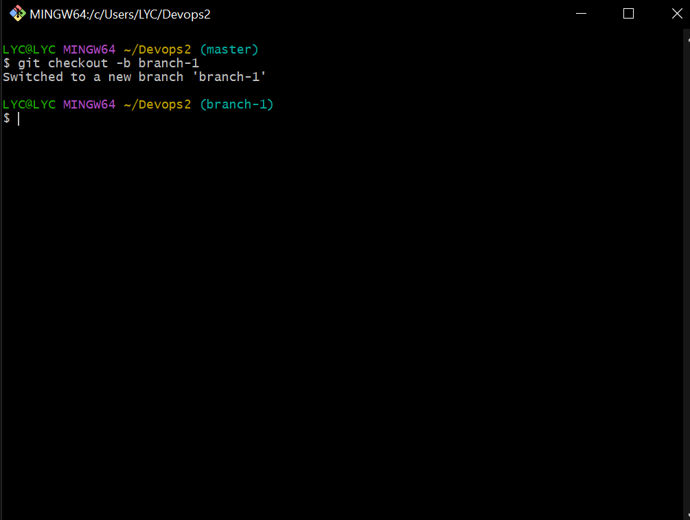

 # Git project

 Most of the intial commands for the git project have been completed while handing in project 1 eg *installing git* and *creating a github account*

 I opened *gitbash terminal* and used the 'mkdir' to create a working folder and initialized it as a git repository.

 

Using the gitbash terminal I created file using the **touch** ,I created a file, *index.txt* and wrote a sentence. Thereafter I did my first commit using **git commit -m** command.

## Working with Branches
Git brances are important because they help to protect the intial code and also help in collaboration with remote teams

Using the git checkout command with the b flag, **git chechout -b** I was able to creat and change into *branch-1*

By using the **git checkout <branch-name>** am able to change from one branch to change into the different branches

## Creating a Github Account

This step was done earlier while documenting for Project 1

