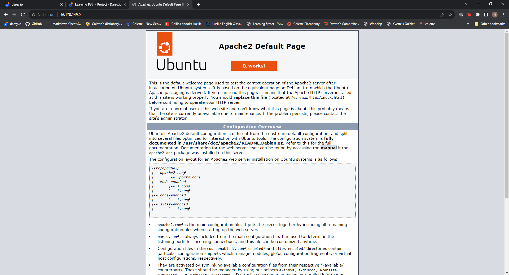

# LAMP Stack Implementation

LAMP stack is a comprehensive set of technologies that are used to build and deploy dynamic websites by combining  four main technologies mainly **Linux**, **Apach**,**MYSQL** and **PHP**(LAMP) 

# Requirements #

1. Install Apache and update the firewall
2. Install MySQL
3. Install PHP
4. Create a virtual host for your website

Inorder to complete this project, I had to provision a ubuntu server from AWS by registering for an account and than launched an instance of t3.micro with ubuntu 22.04LTS

I created 2 inbound rules one to allow ssh to be accessable from everywhere and 2nd one to open hht port to allow access from the web.

I than went ahead and connected to my instance using the windows powershell and the public keys from the E2c instance

## Installing PHP and updating the firewall ##

Apache server is an open source software that is available for free.It runs on more than half of all webservers in the world.It can be highly customized to meet the needs of many different environments by using extensions and modules.

 I run the *sudo apt update*
  

  Than I run the *sudo apt install apache2* to install apache
  

By running the *sudo systemctl status apache2* or *sudo service apache2 status* I was able to confirm that apache was installed and is running by confirming that it is **Green**

I than went ahead to update the ufw firewall and made sure that HTTP port 80 was open on my ubuntu server

I than went ahead to open my web brower and put *http://public-IP-address:80*  to confirm that apache2 was running

## Installing Mysql ##

I than went ahead and installed a Database Management System to be able to store and manage data for my site. In this case I installed **Mysql**.which is considered to be a *Relational Database* by running *sudo apt install mysql-server* command.After which I ran the *sudo mysql* command to log into the database.

I also ran *sudo mysql_secure_installation* to remove some unsecure default settings,set a password for my database and made my database more secure

## Installing PHP ##

I than installed the component/stack that would process the code to display the dynamic conent to the user.In addition I installed 2 more packages to enable PhP to communicate with the database,Mysql and the other one to enable Apache to handle Php files.

I than created a vitual host for my website. 

And the end results was to display this page .

