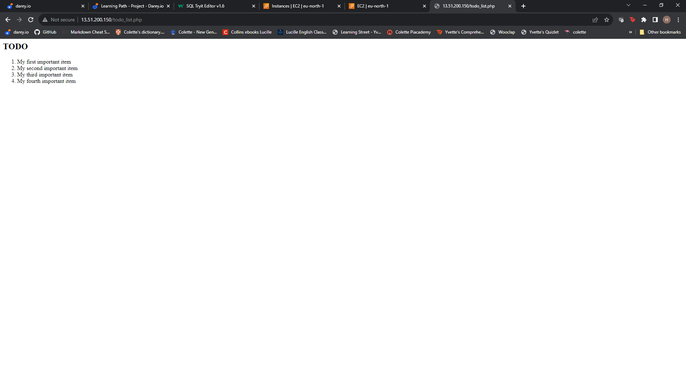

# WEB STACK IMPLEMENTATION (LEMP STACK)

I this project I implemented a with an alternative web server - **NGINX**

Nginx is a *http* and reverse proxy server,a mail proxy server and a generic *TCP/UDP* proxy server.

It is used by *DROPBOX*, *NETFLIX*, *WORDPRESS* to mention but afew.

## REQUIREMENTS ##

- AWS account
- Ubuntu server
- Terminal for SSH access to the E2c instance 
- Install Nginx Web Server
- Install MySQL
- Install PHP

I launched an instance from AWS running on Ubuntu Server 22.04 LTS and was able to connect to it via the git bash terminal.

## INSTALLING NGINX ##

I than ran the *sudo apt update* and the *sudo apt install nginx* commands to install Nginx

I than ran the *sudo systemctl status nginx* to confirm that nginx was succefully installed and running as a service in ubuntu.

I also went ahead to open http/port 80 on my AWS instance so that I could be able to access my web server from the internet

I also confirmed that I was able to connect to Nginx from a web browser.

## INSTALLING MYSQL

I ran the command *sudo apt install mysql-server* to install MySQL as the Database Management System to be able to store and manage data for the site.

I went ahead to also secure my database by creating a password hence strengthening the security to my DB.

## INSTALLING PHP AND CONFIGURING NGINX TO USE PHP PROCESSOR. ##

By running the following command *sudo apt install php-fpm php-mysql* I was able to install PHP and two more modules, one to handle communication between PHP and NGINX and the second one to handle communication between PHP and the DB in this case MySQL. 

I configured Nginx to use the PHP processor as well

To test out my website,I created a sample Db by logging into MySQL console and running the following command 
>CREATE DATABASE 'example_database';

I also created a new user and granted them full privileges to the Db that i have just created

I created a test table named **todo_list** from MySQL console by running the following command

>CREATE TABLE example_database.todo_list (item_id INT AUTO_INCREMENT,content VARCHAR(255),PRIMARY KEY(item_id));

I inserted a few rows of conent in the test table.

And I was able to confirm that my website was up and running on a web browser.

