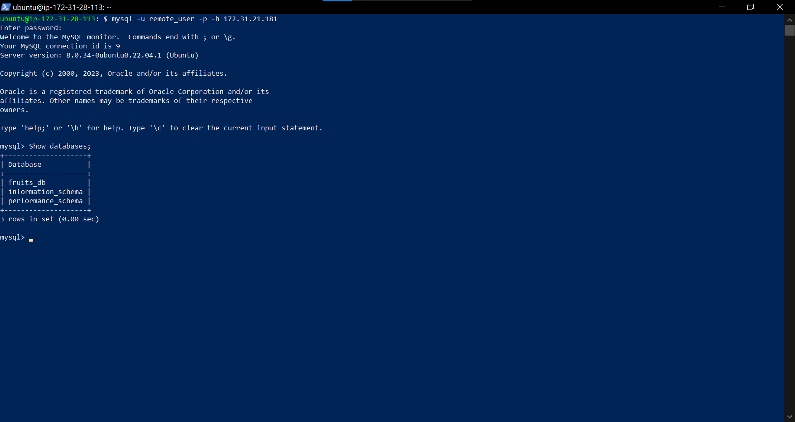

# Implementing a Client Server Architecture using Mysql Database Management System (DBMS) #

In this project, I attempted to implement a client server architecture using Mysql Database Management system by provisioning two E2c instances from AWS. 

Instance one, **Mysql Server** was provisioned with *Mysql server* software and Intance two, **Mysql_client** was provisioned with *Mysql client* software.

## MySql Server ##
I created a user, **Remote_user** with a password and granted them permssion to access the Database.

I also created a database, **fruits_db**

By editing *Mysqld.cnf*, I was able to allow connection to my database from anywhere by changing the bind-address to 0.0.0.0.

I also went ahead to open port 3306 and granted permission to **Mysql_client** ONLY to connect to MYSQL by specifying **Mysql_client** IP address as the only one to be granted access.

## Mysql_client ##

By entering the command  **mysql -u remote_user -p h *ip address of Mysql server***, I was able to log in and access mySql database without using ssh from **mysql database**

