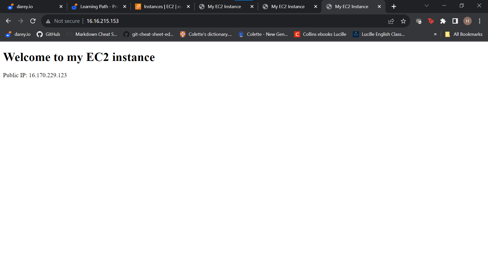

# Implementing Loadblancers with Nginx #

Load balancing is the distrubution of work loads of tasks among several computers or servers so that no one computer or server gets overloaded with too much work.

This helps everything run smoothly and ensures websites and apps work quickly and don't get too slow.

In this project am going to **Nginx** as my load balancer. **Nginx** is a versatile software that acts like a webserver,reverse proxy and a load balancer.

## Prerequisite ##
- Two aws EC2 instances running on ubuntu and installed with *apache* webserver on both of them .

- One aws EC2 instance running on ubuntu and installed with **Nginx** and configure it to act as a load balancer distributing traffic across the two apach webservers.

## Apache Webservers ##

I provisioned two EC2 webservers, updated them and installed apache on them using the below command

 > sudo apt update -y &&  sudo apt install apache2 -y 

 

## Configuring Apache to serve a page showing it,s public IP ##
Using my *vi* text editor, I added a new listen directive for port 8000.

Next I edited  /etc/apache2/sites-available/000-default.conf file and changed port 80 to port 8000.

I restarted apache in order to load the new configuration using the command below:

> sudo systemctl restart apache2

I created a new index.html file,changed ownship of the file and also replaced/overrod the default html file of apache.

I restarted apache and I was able to connect to my website using the server  public IP address.

This was done on both of my EC2 instances that were provisioned as webservers with *Apache* installed on both of them.

## Configuring Nginx as a Load Balancer ##

I provisioned a 3rd EC2 instance,updated it and installed *Nginx* using the command below:

> sudo apt update -y && sudo apt install nginx -y

I edited the */etc/nginx/conf.d/loadbalancer.conf* with new information about the Public IP addresses of my two webservers including the repective listening ports (port 8000) and also included the public IP address of my Load Balancer.

I tested my configuration with the below command:

> sudo nginx -t

Finally I tested my Load balacer set up by using my Nginx Load Balancer Public IP address to get to my website pages.

