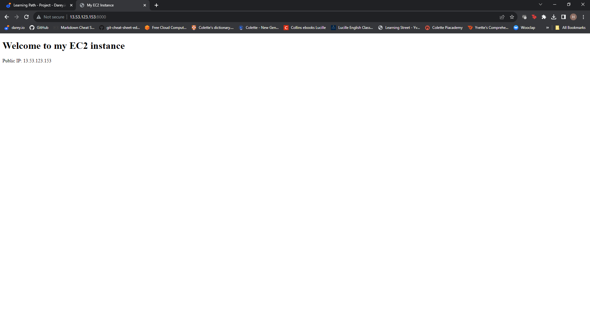
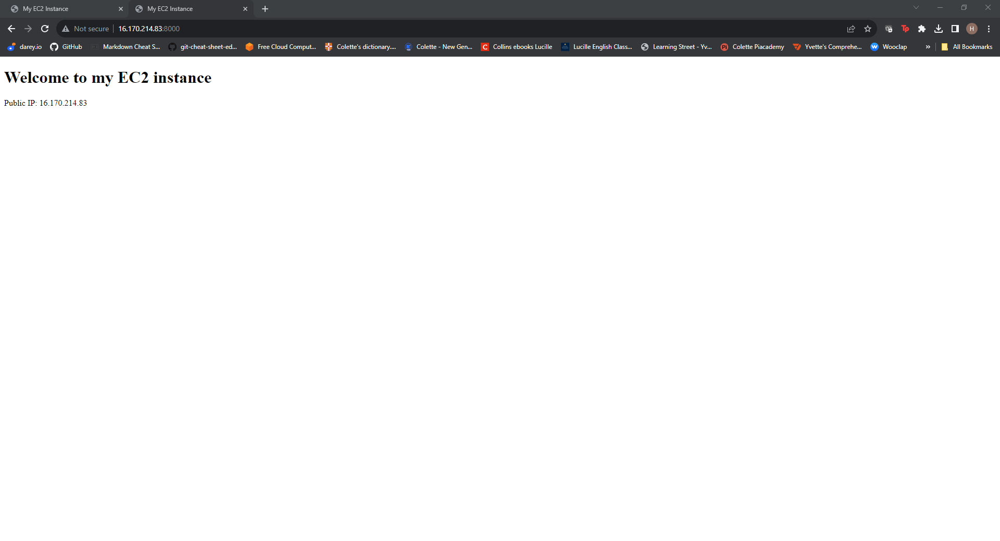

# Automating Loadbalancer configuration with Shell scripting #

In this project I will be automating the entire procecess of implementing a load balancer to distribute traffic across two backend webservers. As a DevOps engineer automation is at the heart of what we do.

Automation helps us speed the deployment of services and reduces the chance of making errors in day to day activities/tasks.

## Prerequisites:

- Provision three EC2 instances from *AWS* running on *ubuntu*

- Two of the three instances will be configured with **Apache**,which will be my webservers.

- The third EC2 instance will be configured with **Nginx** which is going to be used as my *loadbalancer*

## Deploying and Configuring the Webservers. ##

I provisioned two EC2 instances and opened port 8000 on both of them to allow traffic from anywhere using the security group.

Next I created a file **install.sh** and wrote my shell script .

I than changed permissions on **install.sh** file in order to make it an excutable file.

I than ran the command below:

>     ./install.sh PUBLIC_IP

I replaced *PUBLIC_IP* with the correct public ip addresses of my webservers.

Basically what the script did was to update apt, installed apache2, created/opened a new listening port,8000. The script also changed a few file permissions inorder to change the virtualHost port from port 80 to port 8000. It also created a new **index.html** file .

The script was run on both of my webservers.

I was than able to get to my website via the public ip addresses of my webservers via port 8000

## Deploying and Configuring Nginx Load Balancer. ##

I provisioned EC2 instance running on ubuntu. I also opened port 80 on the EC2 instance for it to be connected to from anywhere.

I than created  *nginx.sh* file and pasted my script and than saved it.

The script did the following:

- It updated the apt and than installed *nginx*
- It created /etc/nginx/conf.d/loadbalancer.conf.
- It changed file permissions on two files namely **etc/nginx/conf.d/loadbalancer.conf** and **/etc/nginx/**

I than changed the file permissions of **nginx.sh** to turn it into an excutable file.

I than ran the excutable file  using the below command:

> ./nginx.sh PUBLIC_IP Webserver-1 Webserver-2

replacing **PUBLIC_IP Webserver-1 Webserver-2** with the public IP addresses of my webservers inculding the corresponding ports.

I was able to get to my website using the public ip address of my nginx load balancer.

